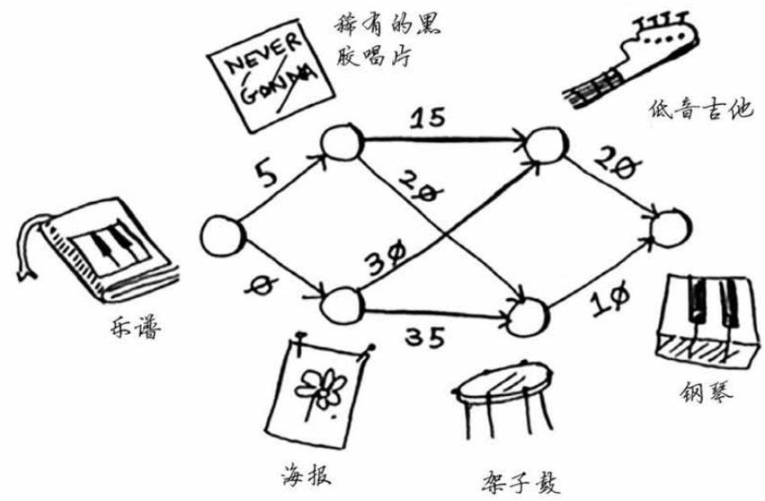

### 换钢琴
Rama 想要钢琴，她手上有乐谱，如何才能用最小的代价换到钢琴呢？

|父节点|节点|开销|
|-|-|-|
|乐谱|黑胶唱片|5|
|乐谱|海报|0|
|黑胶唱片|低音吉他|15|
|黑胶唱片|架子鼓|20|
|架子鼓|钢琴|10|

1. 乐谱的邻居节点，海报最便宜（花费0），其次是黑胶唱片（花费5），选择海报；
2. 选择海报，更新邻居节点的开销。海报的邻居节点，低音吉他最便宜（0+30），其次是架子鼓（0+35），设置海报为低音吉他和架子鼓的父节点；
3. 执行第一步，由于乐谱的邻居节点中，海报已经处理。那么选择黑胶唱片。
4. 选择黑胶唱片，更新邻居节点的开销。黑胶唱片的邻居节点，低音吉他最便宜（5+15），其次是架子鼓（5+20）；
5. 此时发现，4.提供的路径比 2.的便宜，因此更新黑胶唱片作低音吉他和架子鼓的父节点。
6. 乐谱的邻居节点已全部处理；黑胶唱片和海报的邻居节点是一样的，即低音吉他和架子鼓。低音吉他最便宜，选择低音吉他。
7. 选择低音吉他，更新它的邻居节点的开销。只有钢琴一个邻居节点，开销是（5+15+20），设置低音吉他为钢琴的父节点。
8. 返回到 6.低音吉他已处理，选择架子鼓。
9. 选择架子鼓，更新它的邻居节点的开销。只有钢琴一个邻居节点，开销是（5+20+10）。
10. 此时发现，9.提供的路径比 8.便宜，因此更新架子鼓为钢琴的父节点。最终路径为，乐谱→黑胶唱片→架子鼓→钢琴，总花费为 35。
