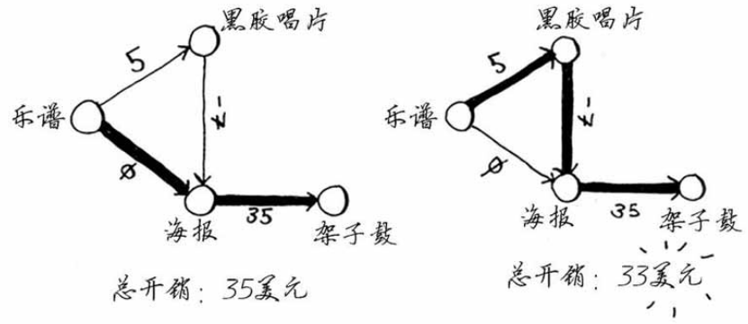

### 负权边

即从一个节点到邻居节点的权重为负。此时不能使用狄克斯特拉算法！

定义：开销，指从起点到该节点的总花费。一开始，除了起点的邻居，其他节点的开销都是 infinity。

| 父节点 | 节点     | 开销     |
| ------ | -------- | -------- |
| 乐谱   | 黑胶唱片 | 5        |
| 乐谱   | 海报     | 0        |
|        | 架子鼓   | infinity |

1. 首先，从乐谱开始。选取乐谱最便宜的邻居节点：海报。
2. 设置海报的父节点为乐谱，海报的开销为0。检查海报的邻居节点，只有一个架子鼓。此时更新架子鼓的开销，由 infinity 变为 0 + 35 = 35；更新架子鼓的父节点为海报。然后标记海报为已处理节点。

| 父节点 | 节点     | 开销     |
| ------ | -------- | -------- |
| 乐谱   | 黑胶唱片 | 5        |
| 乐谱   | 海报     | 0        |
|   海报     | 架子鼓   | 35 |

3. 返回乐谱的邻居节点，此时由于海报已处理，那么选择黑胶唱片。
4. 返回第二步，最便宜的海报已经处理过，那么选中黑胶唱片，更新其邻居节点的开销。并设置海报的父节点为黑胶唱片。
5. 糟糕，海报已经处理过了，因此算法判定黑胶唱片没有要进一步筛查的邻居节点。

| 父节点   | 节点     | 开销 |
| -------- | -------- | ---- |
| 乐谱     | 黑胶唱片 | 5    |
| 黑胶唱片 | 海报     | -2   |
| 海报     | 架子鼓   | 35   |

在包含负权边的图中，要找出最短路径，可使用另一种算法——贝尔曼-福德算法（Bellman-Ford algorithm）

