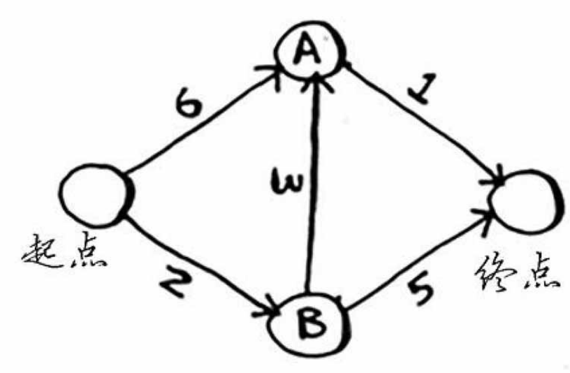
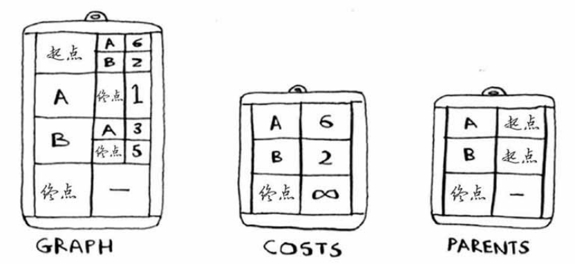
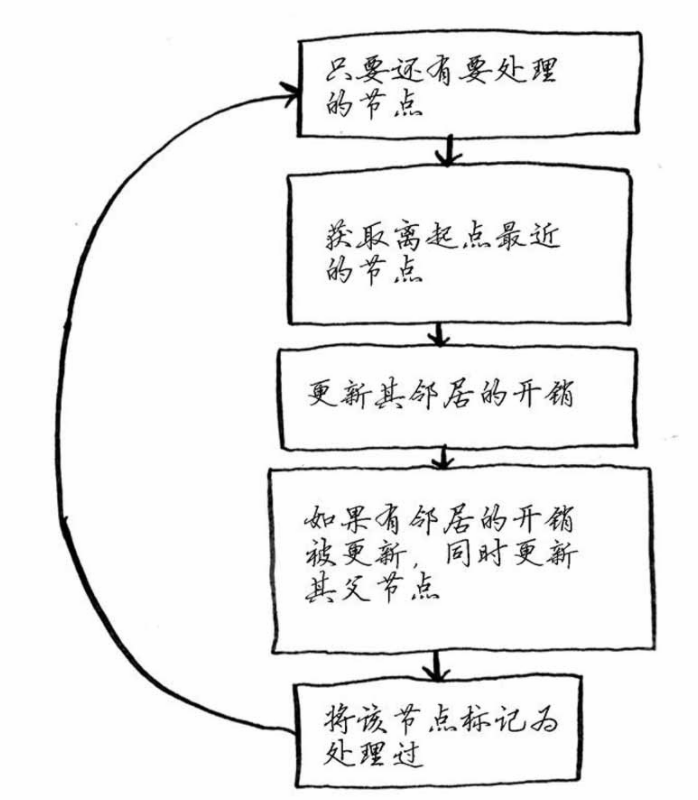
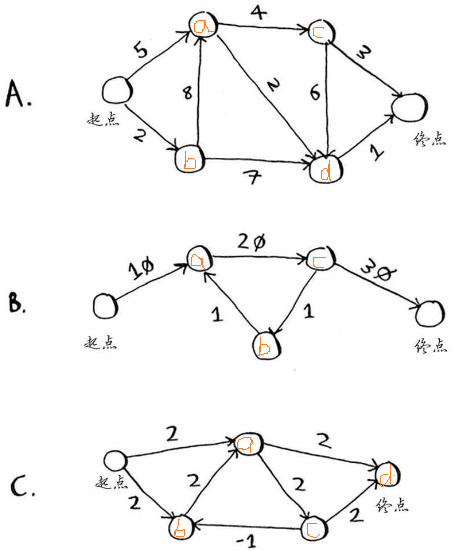

### 实现狄克斯特拉算法

要编写解决这个问题的代码，需要三个散列表。

算法逻辑

注意：

* 开销指的是从起点到该节点的花费。一开始，只有起点的邻居节点，可以明确开销。其它节点通通是 infinity。

### 练习 7.1

答：

A：{'a': 'start', 'b': 'start', 'c': 'a', 'd': 'a', 'fin': 'd'}       
8

B：{'a': 'start', 'b': 'c', 'c': 'a', 'fin': 'c'}
60

C：由于存在负权边，此题无法用狄克斯特拉算法计算，得在代码里加个判断。 ~~{'a': 'start', 'b': 'start', 'c': 'a', 'fin': 'a'} 4~~ 

