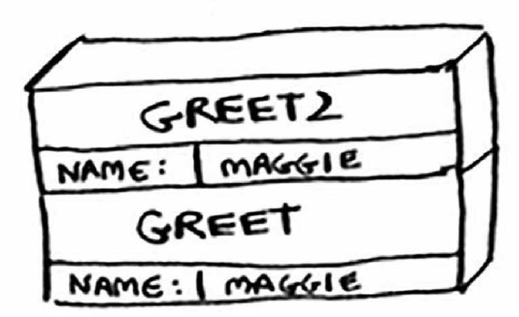

### 栈
先入先出的简单数据结构。

### 调用栈
计算机在内部使用被称为调用栈的栈。

### 练习
3.1 根据题图的调用栈，你可获得哪些信息？


答：greet 函数内调用了 greet2函数，且greet2函数使用的参数与 greet函数一样是 NAME = MAGGIE。

**未意识到的**：此时函数 greet处于未完成（挂起）状态，当前的函数调用为函数 greet2，greet2执行完成后将继续执行 greet。

### 递归调用栈

递归函数也使用调用栈。factorial(5) 写作 5! 计算阶乘的递归函数：

```Python
	def fact(x):
		if x == 1:
			return 1
		else:
			return x * fact(x-1)
```

### 使用栈的代价
存储详尽的信息可能要占用大量的内存。如果栈很高，就意味着计算机存储了大量函数调用的信息。两个办法：

* 重新编写代码，转而使用循环
* 使用尾递归。

### 练习
3.2 假设你编写了一个递归函数，但不小心导致它没完没了地运行。正如你看到的，对于每次函数调用，计算机都将为其在栈中分配内存。递归函数没完没了地运行时，将给栈带来什么影响？

栈越堆越高。
（回答过于简单，补充：每个程序可调用的栈空间都有限，程序用完这些空间（终将如此）后，将因栈溢出而终止。