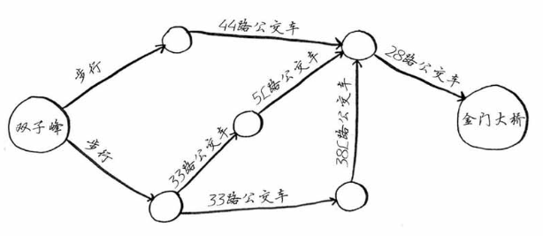

### 图简介
假设你居住在旧金山，要从双子峰前往金门大桥。你想乘公交车前往，并希望换乘最少。可乘坐的公交车如下。

为找出换乘最少的乘车路线，你将使用什么样的算法？

可以一步到达吗？两步呢？或者三步？四步的有吗？

最终发现前往金门大桥的最少换乘路线是三步。这种问题被称为最短路径问题（shortest-path problem）。解决最短路径问题的算法被称为广度优先搜索。

要确定如何从双子峰前往金门大桥，需要两个步骤。

1. 使用图来建立问题模型。
2. 使用广度优先搜索解决问题。