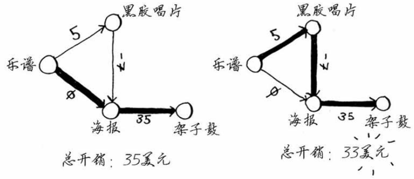

### 负权边

即从一个节点到邻居节点的权重为负。此时不能使用狄克斯特拉算法！

1. 首先，选中乐谱；
2. 选中乐谱，更新它邻居节点的开销。海报最便宜是（0）；其次是黑胶唱片（5）。
3. 选中海报，更新它邻居节点的开销。只有一个邻居节点，架子鼓，（0+35）。设置乐谱为海报的父节点。
4. 返回第二步，最便宜的海报已经处理过，那么选中黑胶唱片，更新其最便宜的未处理的邻居节点。糟糕，海报已经处理过了，因此算法判定黑胶唱片没有要处理的邻居节点。

| 父节点 | 节点     | 开销 |
| ------ | -------- | ---- |
| 乐谱   | 黑胶唱片 | 5    |
| 乐谱   | 海报     | 0    |
| 海报   | 架子鼓   | 20   |

在包含负权边的图中，要找出最短路径，可使用另一种算法——贝尔曼-福德算法（Bellman-Ford algorithm）

